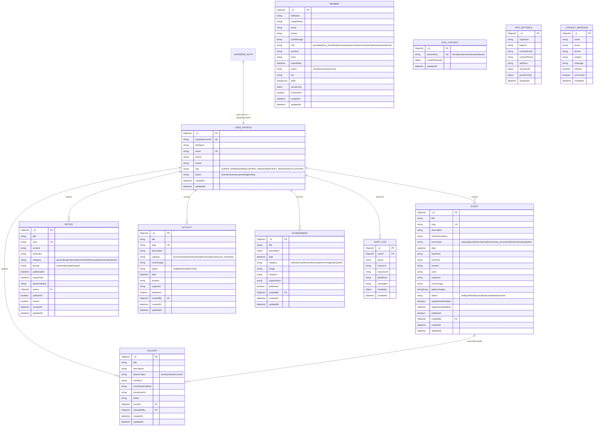

# HIGH SCHOOL YOUTH CLUB — ENTITY RELATIONSHIP & SCHEMA ARCHITECTURE

## Overview
High School Youth Club employs a dual data architecture:
1. **Supabase Auth (`auth.users`)**: Handles user identities, cryptographic password hashing, email confirmations, session tokens, and JWT issuance.
2. **MongoDB Database**: Houses application-level entities, relational references, full-text searchable indexes, audit trails, and unstructured CMS payloads.

The two systems are coupled via `UserProfile.supabaseUserId <-> auth.users.id`.

---

## Mermaid Diagram

---

## Indexing Strategy
- **Text Search Indexes**:
  - `Event`: `{ title: "text", description: "text", location: "text" }`
  - `Notice`: `{ title: "text", content: "text" }`
  - `Activity`: `{ title: "text", description: "text" }`
  - `Member`: `{ fullName: "text", nepaliName: "text", bio: "text" }`
- **Compound & Filter Indexes**:
  - `Event`: `{ published: 1, date: -1 }`
  - `Notice`: `{ pinned: -1, publishedAt: -1, published: 1 }`
  - `Gallery`: `{ eventId: 1, createdAt: -1 }`
  - `AuditLog`: `{ createdAt: -1, resource: 1 }`
  - `AuditLog TTL`: Automatic expiry after 365 days via `{ expireAfterSeconds: 31536000 }`
